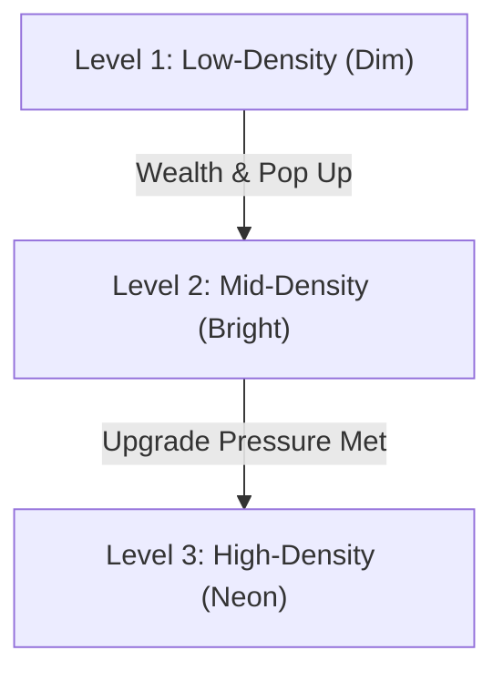

# Project Acheron — Visual Style Manifest

This document serves as the official design specification for Project Acheron. It defines the aesthetic standards, color systems, grid visual logic, and animation rules required to build a "minimal cyberpunk simulation sandbox."

---

## 1. Aesthetic Identity: "Minimal Cyberpunk Infrastructure Sandbox"

Acheron prioritizes **simulation readability** and **neon structural aesthetics** over photorealistic art. The world represents a living, glowing urban system operating at night under heavy rain and industrial atmospheric pressure.

### Core Visual Principles:
* **Sleek Contrast**: High-contrast elements against a deep, dark blue-grey void.
* **Functional Radiance**: Light indicates activity. If it simulates, it glows.
* **Zero Clutter**: Clean grid cells, modular geometry, no excessive noise or decorative fillers.
* **Color as Data**: Colors do not just decorate; they directly communicate simulation state.

---

## 2. Color Palette & Zoning Rules

Acheron uses a highly curated HSL color palette to represent urban zoning, infrastructural health, and pressure states.

### Core Simulation Colors
| Role / Zone | Visual Meaning | Color Signature | RGB / HEX Representation |
| :--- | :--- | :--- | :--- |
| **Grid Boundary** | Base city sandbox | Deep Navy | `Color{15, 20, 32, 255}` (`#0F1420`) |
| **Stable District** | Standard Residential/Low-stress | Neon Blue | `Color{0, 140, 255, 255}` (`#008CFF`) |
| **Economic Growth** | Commercial development / Wealth | Bright Green | `Color{0, 230, 118, 255}` (`#00E676`) |
| **Industrial Zone** | Resource generation / Production | Deep Violet | `Color{142, 36, 170, 255}` (`#8E24AA`) |
| **Traffic Congestion**| Slow routes / Lane pressure | Intense Crimson| `Color{255, 23, 68, 255}` (`#FF1744`) |
| **Upgrade Pressure** | Zoning evolution requirement | Radiant Amber | `Color{255, 214, 0, 255}` (`#FFD600`) |
| **Systemic Failure** | High instability / Unrest / Shutdown| Neon Red Pulse| `Color{255, 0, 85, 255}` (`#FF0055`) |

---

## 3. UI Dashboard Aesthetics

The UI is a digital neon terminal framing the city grid.

* **Layout Structure**:
  * **Left Side**: The primary 2D grid viewport, scaled dynamically, wrapped in a thin glowing frame.
  * **Right Side**: Vertical panels detailing system telemetry, controls, and active overlays.
* **Panel Panels**:
  * Dark semi-transparent panels: `Fade(BLACK, 0.75f)`.
  * Borders: 1px thin borders using `Fade(SKYBLUE, 0.4f)` with glowing corners.
  * Header accents: Left-aligned neon bar (3px wide) next to titles.
* **Dashboard Telemetry**:
  * Real-time counters showing **FPS**, **ECS entity count**, **congestion metric**, and **accumulated wealth**.
  * Mini charts and progress bars showing resource pressures.

---

## 4. District Visual Evolution (Dim → Bright → Neon)

Districts evolve across three visual levels based on population, wealth, and infrastructure state.

### Level 1: Low-Density (Dim)
* **Visuals**: Sparse tiles, dim window lights, desaturated blue/violet tones.
* **Atmosphere**: Low energy, low traffic, weak light emission.

### Level 2: Mid-Density (Bright)
* **Visuals**: Distinct structures, bright warm window grids, clean neon signs, visible streets.
* **Atmosphere**: Active economy, moderate traffic paths, steady ambient glow.

### Level 3: High-Density (Neon)
* **Visuals**: Tall modular towers, intense color-coded lighting, roof cooling towers, glowing districts.
* **Atmosphere**: Hyper-active economy, dense surrounding vehicles, pulsing overlay effects.

---

## 5. Neon Roads & Overlays

### Roads
* Roads are rendered as solid neon conduits: `DrawLineEx` with dynamic thickness (3.0f to 5.5f) depending on congestion.
* Color gradients dynamically transition from **Teal (`#00F2FE`)** (optimal speed) to **Neon Orange/Red** (congestion waves).
* A subtle glowing path pulse flows along the lanes at a speed proportional to the traffic flow rate.

### Heatmap Overlays (Cycle-able)
Heatmaps render as semi-transparent overlay grids (`Fade(color, 0.25f)`) directly on the district tiles:
* **Traffic Heatmap**: Orange to Crimson overlays indicating lane density.
* **Economy Heatmap**: Warm gold and rich green overlays indicating resource hubs.
* **Instability Heatmap**: Neon pink-red pulsing grids showing system strain.
* **District Upgrades**: Highlighting districts under high upgrade pressure with dotted neon borders.

---

## 6. Procedural Glow & Animation Rules

To maintain high performance on university presentation laptops, glow and animation are computed procedurally without heavy shader stacks:

* **Emissive Pulse**: Flashing warnings use a sine wave modifier on the alpha channel:
  $$\alpha = 0.4f + 0.6f \cdot \sin(8.0f \cdot \text{GetTime()})$$
* **Particle Trails**: Tiny 1px/2px neon particles emit from high-wealth commerce zones and float upward, fading out.
* **Rain Streaks**: Diagonal line particles (`DrawLine`) sweep downwards at a 75-degree angle to create a wet, high-speed atmospheric overlay.
* **Congestion Wave Pulse**: Disturbed road segments pulsate their thickness and glow when gridlock peaks.
